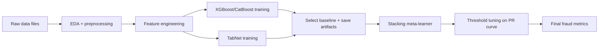

# Financial Fraud Detection with Machine Learning

## What the project does
This project builds an end-to-end, research-oriented fraud detection pipeline for financial transactions. It covers data ingestion and cleaning, feature engineering, supervised model training (including TabNet, XGBoost, CatBoost, and stacking), and causal analyses to explore treatment effects and drivers of fraud.

## Why the project is useful
- **Practical pipeline**: A reproducible workflow from raw transaction data to trained models.
- **Model benchmarking**: Multiple model families and stacking for performance comparison.
- **Interpretability**: SHAP-based explainability in modeling notebooks.
- **Causal insights**: Dedicated notebooks for causal inference and treatment effect modeling.

## Feature engineering overview
The feature engineering notebook focuses on creating high‑signal tabular features before modeling. Key themes include:

- **Time-based features**: transaction hour/day patterns and temporal aggregates.
	- Examples: hour-of-day, day-of-week, weekend/holiday flags, and rolling window stats.
- **Customer and card behavior**: rolling spend statistics, velocity features, and consistency checks.
	- **Velocity** refers to frequency of transactions made e.g. `daily_transaction_count` and `weekly_transaction_count`, and by short gaps in `time_since_last_txn` (see `temporal_features_client`).
	- **Burst behavior** refers to clusters of transactions in short time windows, reflected by low `time_since_last_txn` plus elevated daily/weekly counts.
	- **Volatility** is measured via `amount_change_rate` and `amount_change`, with extreme shifts flagged by `large_amount_change` and `large_txn_time_diff_change` (see `calculate_event_features`).
- **Merchant/MCC enrichment**: category-level behavior and outlier detection.
	- Examples: per‑MCC spend baselines and merchant‑level rarity signals.
- **Geospatial features**: distance between transaction locations to flag abnormal travel patterns.
	- Not completed due to the large volume of geocoding API calls required, but the notebook includes the full workflow and rationale for this feature set.
- **Anomaly signals**: isolation‑based scores and rare-pattern indicators.
	- Examples: isolation forest scores and frequency‑based rarity flags assessed on an individual level and in combination with other features.

See [Pre-processing/feature_engineering.ipynb](Pre-processing/feature_engineering.ipynb) for the full workflow and rationale.

## Modeling approach (why these models and stacking)
This project treats fraud detection as a tabular classification problem with strong non‑linearities and class imbalance. The predictive workflow is designed to compare complementary model families and then combine their strengths in a stacking ensemble:

- **XGBoost + CatBoost first**: Gradient-boosted trees are strong baselines for tabular data, and both models are trained to **compare performance** and decide the most effective baseline to carry forward. CatBoost is robust to categorical features and reduces target leakage with ordered boosting, while XGBoost provides flexible regularization and strong performance on mixed numeric/categorical encodings.
- **TabNet next**: TabNet uses attentive feature selection at each decision step, which can improve performance and interpretability on high‑dimensional tabular data where interactions matter.
- **Final stacking**: The final stack combines **CatBoost + TabNet** predictions and trains a **logistic regression meta‑learner** on their probability outputs. This reduces individual model bias/variance and improves generalization on rare fraud cases.

The notebook order reflects this design: build strong base learners, then blend them in a stacking model to maximize detection quality.

### End‑to‑end workflow


### Final tuning and fraud precision/recall
The stacking notebook tunes the decision threshold by maximizing F1 on the precision‑recall curve. In [Predictive model/Final_Stacking_Model.ipynb](Predictive%20model/Final_Stacking_Model.ipynb), the best threshold is approximately **0.688**. Summary of fraud‑class results on the test split:

| Metric | Value |
| --- | --- |
| Threshold (best F1) | ~0.688 |
| Precision (fraud) | ~0.92 |
| Recall (fraud) | ~0.59 |
| F1 (fraud) | ~0.72 |
| Average precision | ~0.728 |

## Repository structure
- **Pre-processing/**: Data exploration, cleaning, and feature engineering notebooks.
	- [Pre-processing/eda.ipynb](Pre-processing/eda.ipynb) – exploratory analysis and preprocessing.
	- [Pre-processing/feature_engineering.ipynb](Pre-processing/feature_engineering.ipynb) – feature engineering and transformations.
- **Predictive model/**: Model training notebooks.
	- [Predictive model/xgb_catboost.ipynb](Predictive%20model/xgb_catboost.ipynb)
	- [Predictive model/model_tabnet.ipynb](Predictive%20model/model_tabnet.ipynb)
	- [Predictive model/Final_Stacking_Model.ipynb](Predictive%20model/Final_Stacking_Model.ipynb)
- **Causal inference/**: Causal ML analysis notebooks.
	- [Causal inference/CausalNL_analysis.ipynb](Causal%20inference/CausalNL_analysis.ipynb)
	- [Causal inference/Extension_Causal_ML.ipynb](Causal%20inference/Extension_Causal_ML.ipynb)

## How users can get started

### Prerequisites
- Python 3.x
- Jupyter Notebook or JupyterLab

### Data setup
This project uses the Kaggle dataset created by Caixabank Tech for the 2024 AI Hackathon.

1. Download the data from Kaggle and place the following files in the repository root:
	 - `transactions_data.csv`
	 - `cards_data.csv`
	 - `users_data.csv`
	 - `mcc_codes.json`
	 - `train_fraud_labels.json`

	 Dataset link: https://www.kaggle.com/datasets/computingvictor/transactions-fraud-datasets/data?select=transactions_data.csv


### Install dependencies
The notebooks and scripts use common data science libraries. Install the core set below, and add model-specific libraries as needed:

- Core: `pandas`, `numpy`, `scikit-learn`, `matplotlib`, `seaborn`, `joblib`
- Modeling: `xgboost`, `catboost`, `pytorch-tabnet`, `torch`, `optuna`
- Imbalanced learning: `imbalanced-learn`
- Explainability: `shap`
- Causal inference: `econml`, `causalml`, `dowhy`
- Feature engineering extras: `geopy`, `requests`, `swifter`, `mlxtend`, `gdown`

### Usage examples

#### 1) Run preprocessing and EDA
Open [Pre-processing/eda.ipynb](Pre-processing/eda.ipynb) and run the notebook end-to-end.

#### 2) Train or review models in notebooks
Run the predictive modeling notebooks in this order:
1. [Predictive model/xgb_catboost.ipynb](Predictive%20model/xgb_catboost.ipynb)
2. [Predictive model/model_tabnet.ipynb](Predictive%20model/model_tabnet.ipynb)
3. [Predictive model/Final_Stacking_Model.ipynb](Predictive%20model/Final_Stacking_Model.ipynb)

Causal notebooks can be run independently under [Causal inference/](Causal%20inference).

#### 3) Load a trained model artifact
An example artifact is available at [Predictive model/catboost_precision.joblib](Predictive%20model/catboost_precision.joblib):

```python
import joblib
model = joblib.load("Predictive model/catboost_precision.joblib")
```

## Where users can get help
- Review the notebooks for workflow details and experiments:
	- [Pre-processing/eda.ipynb](Pre-processing/eda.ipynb)
	- [Predictive model/Final_Stacking_Model.ipynb](Predictive%20model/Final_Stacking_Model.ipynb)
	- [Causal inference/CausalNL_analysis.ipynb](Causal%20inference/CausalNL_analysis.ipynb)
- If you are using GitHub, open an issue in the repository for questions or bugs.

## Who maintains and contributes
Maintained by contributors in the McGill-MMA-EnterpriseAnalytics organization.

Contributions are welcome. Please read [CONTRIBUTING.md](CONTRIBUTING.md) before submitting a pull request.
